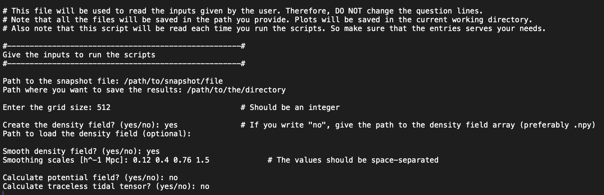
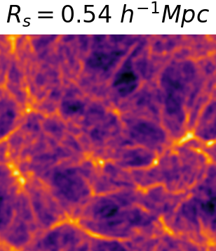
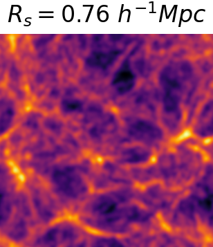
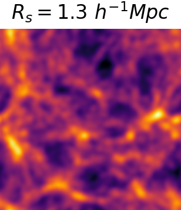
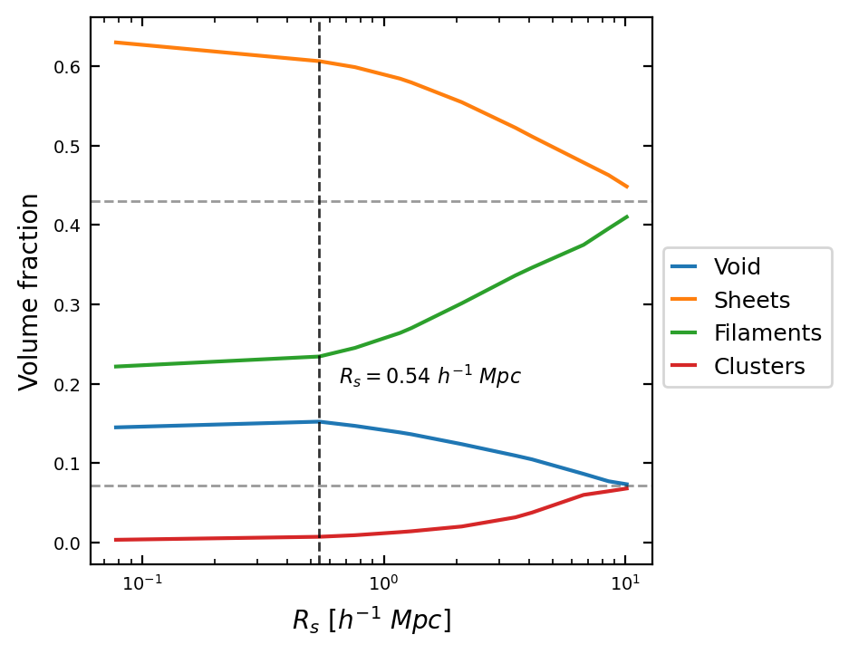
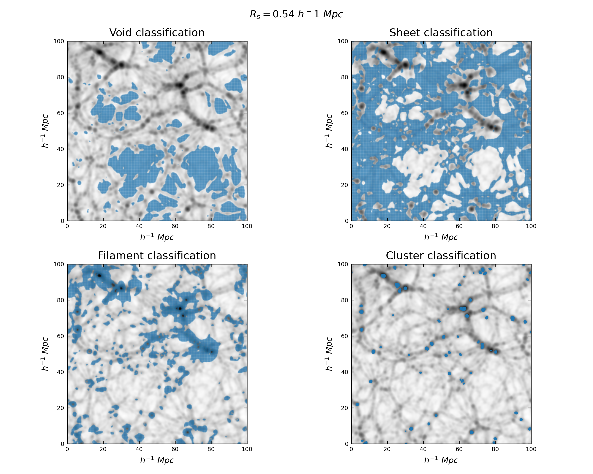
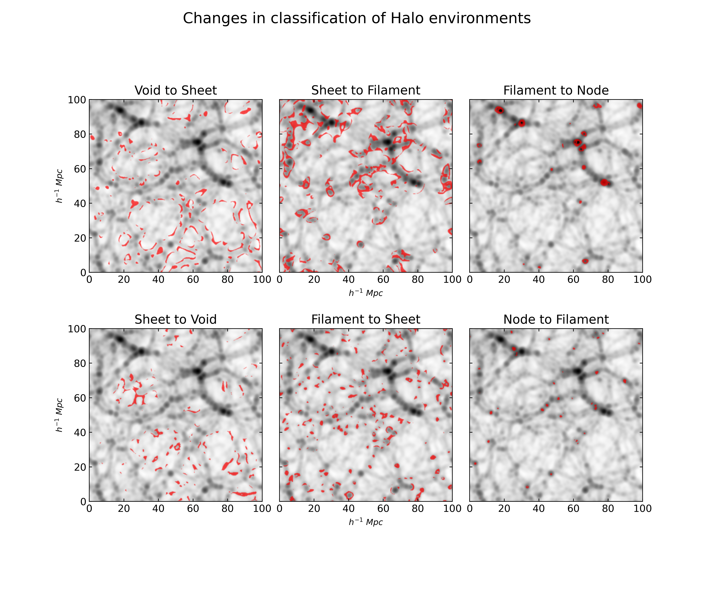

# T-Web Classification for the Cosmic Web

Welcome to the **T-Web Classification Analysis** project! This repository provides tools to calcualate and analyze the classification of cosmic large-scale structures based on the tidal fields in a cosmological simulation box for various smoothing scales.

## Overview

This projects helps you perform calculations to derive the tidal fields from a simulation snapshot, which is further used to classify the large-scale structures in the simualation box. This is followed by visualizations that help better understand how the structures are classified and how they change with the smoothing scales.

## Features

- **Automated calculations and plotting** All the calculations are done automatically, from calculating the density field to classifying the structures of the Cosmic web. Moreover, although the plots are generated automatically, data is saved for the user for further analysis.
- **Volume Fraction Analysis**: Plot volume fraction of different large-scale structures against smoothing scales.
- **Classification plots**: Visualize how the cosmic structures are classified using T-web classification scheme.
- **Structural changes**: Shows how the number density of large-scale structures change when we alter the smoothing scales.

## Getting started

### Prerequisites

Before running the scripts, ensure you have the following:

- Python 3.x
- Libraries: NumPy, pynbody, Pylians3, tqdm, SciPy, matplotlib

### Instructions

Make sure to follow these instructions before running the scripts:

1. **Ensure required files**: All the files are in the current working directory.

2. **Modify `config/input_params.txt` file**: Edit `config/input_params.txt` to specify the requirement for your analysis. Here's a sample of what the file should look like:

   

3. **Run Required Scripts**: A brief description of what each python script does is given below:

   - `Tidal_Field_Calculator.py`: This script is designed to compute the density field, tidal tensor, potential field, and traceless tidal shear tensor for a given cosmological N-body simulation snapshot. Users have the option to smooth the density field using a Gaussian filter.

   - `T_web_Structure_Classifier.py`: This script classifies the structures based on T-web classification for given tidal shear tensor(s). The tidal shear tensor files are loaded and the eigenvalues and eigenvectors are calculated and further, the structures are classified based on T-web classification scheme.

   - `Tweb_Classification_Analysis.py`: This script analyses the classification of structures based on the T-web classification. The volume fractions of different structures are plotted against the smoothing scales. The classification overlay on the density field is plotted for the given smoothing scales. The changes in the classification of particles are also plotted if the smoothing scales are changed.

   > **Note:** Ideally, you should run `Tidal_Field_Calculator.py` > `T_web_Structure_Classifier.py` > `Tweb_Classification_Analysis.py`

4. **Run the script** Execute the scripts using the following command:

```sh
python3 script_name.py
```

## Output

The script generates various data files (.npy) and plots different features, as shown below:

- Density field smoothing for different smoothing scales
- LSS Volume Fractions vs Smoothing scale
- Overlay of classified large-scale structures on density fields
- Changes number density of the environments when varying the smoothing scales.

### Sample Output












## Author

- Asit Dave: [@asitdave](https://www.github.com/asitdave)

## Acknowledgements

- Thanks to [Prof. Dr. Cristiano Porciani](https://astro.uni-bonn.de/en/m/porciani),  for his valuable guidance in developing this project.

- My family and friends have been a constant source of motivation ❤️

## License

[MIT](https://choosealicense.com/licenses/mit/)

## Contact/Support

Email: [asit1700@gmail.com](mailto:asit1700@gmail.com)

---

## Fork Changes (jkbre)

This fork extends the original repository with modifications made during a summer internship project. Contact: [jakub.breczewski@proton.me](mailto:jakub.breczewski@proton.me)

### New Files

- **`Tweb_Classification_Interface.py`**: A clean programmatic API for computing T-web classification from an external 3D density field, designed for integration with the COLAVERSE pipeline. The main entry point `compute(field, kernel, variant, box, lambda_th, smoothing_scale, ...)` returns a classification array (0=Void, 1=Sheet, 2=Filament, 3=Knot). Includes result caching using COLAVERSE-compatible file naming.

- **`Tweb_Dave_Config_Generator.py`**: A utility script that generates `config/input_params.txt` and `config/config.yaml` from either command-line arguments (`--snapshot`, `--results`, `--grid-size`, `--density-field`, `--potential-field`, `--tidal-tensor`, `--smoothing-scales`) or an existing YAML config file (`--from-file`).

- **`config/config.yaml`**: A structured YAML configuration file as an alternative to `config/input_params.txt`.

### Changes to Existing Files

**`LSS_TWeb_BlackBox.py`**

- Fixed snapshot path validation in `read_input_file()` to support Gadget multi-file format (checks for both `snapshot_path` and `snapshot_path + ".0"`).
- Added `check_tidal_field_files_exist()` and `check_classification_files_exist()` to detect which output files already exist per smoothing scale, and `get_missing_scales()` to return only those still needing computation.
- `load_all_npy_files()` gained an optional `lambda_th` parameter for loading classification matrices named with a threshold suffix.
- `classify_structure()` now accepts a configurable `lambda_th: float` threshold (was hardcoded to 0).
- `plot_classification_overlay()` and `overlay_all_envs()` now display `lambda_th` in plot titles.

**`Tidal_Field_Calculator.py`**

- Added CLI via `argparse`: `--mas` (mass assignment scheme, default `TSC`) and `--force` (force recalculation).
- Added idempotency: checks for existing output files at startup and skips already-computed scales unless `--force` is used.
- Density field, smoothed fields, and particle data are loaded from disk if they already exist instead of being recomputed.

**`Tweb_Structure_Classifier.py`**

- Added CLI via `argparse`: `--lambda_th` (classification threshold, default `0.0`) and `--force`.
- `classify_structures()` now accepts `lambda_th`; output filenames include the threshold value (e.g., `classification_matrix_10_0p0.npy`).
- Added idempotency for eigenvalue/eigenvector and classification matrix steps.
- Added `load_filtered_tidal_shear_files()` to load only the tidal shear files needed for missing scales.

**`Tweb_Classification_Analysis.py`**

- Added CLI via `argparse`: `--lambda_th` (default `0.0`) and `--force`.
- `load_classification_matrices()` now takes `lambda_th` to load files with the correct naming convention.
- Fixed output directory name from `"Classification matrices"` to `"Classification_matrices"` (matches how files are actually saved).
- Plot functions accept `lambda_th`; output filenames include the threshold value to distinguish plots generated with different thresholds.
